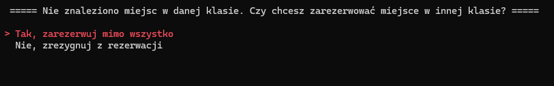
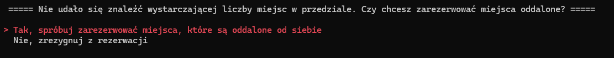
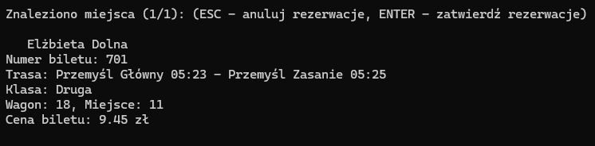

# Autorzy
- [Adam **Marzec**](https://github.com/dhunter49)
- [Marta **Załuska**](https://github.com/mxrtaaa)

# Opis
Nasz program - **system biletów Polskich Kolei Politechnicznych (PKP)** - umożliwia **rezerwowanie miejsc** w pociągach dodanych do bazy danych. Stworzona przez nas przykładowa baza danych zawiera jedno połączenie **Przemyśl Główny - Ustka** (czyli dwie relacje, bo w obie strony). Dodatkowo mamy możliwość **wyświetlenia informacji** o pociągu, pasażerze lub połączeniu. Program jest stworzony dla kasjerów, dlatego też nie ma faktycznego systemu poboru opłat, jedynie wyświetla znalezione miejsca wraz z ceną.

# Porównanie z systemem PKP IC
Nasz system bazuje w swojej strukturze na systemie **PKP IC** - odwzorowaliśmy i wprowadziliśmy do własnej bazy danych wybrane połączenie, w szczególności: stacje na trasie, dokładne odległości między stacjami, czasy przyjazdów i odjazdów, kody pociągów, składy wagonów, ich numery i modele, a także ilości, numery i położenie siedzeń.  
**Ciekawostka:** miejsca w PKP IC są numerowane tak, aby można było łatwiej je obsługiwać, dlatego nawet jeśli miejsca fizycznie nie znajdują się w przedziale, to i tak mają przydzielony przedział, a ich numer składa się z numeru przedziału i numeru miejsca w tym przedziale - dlatego nigdy nie spotkamy miejsca 10, 20, czy też 39. 

Naszym celem było **zniwelować niektóre problemy**, które istnieją obecnie w systemie PKP IC:
- możliwość rezerwacji tylko dla grup, w których ilość osób jest mniejsza od 6 - **skutecznie**, nasz program wspiera rezerwacje **bez określonego limitu osób**, był testowany nawet dla absurdalnie dużych liczb takich jak 140 osób
- przy rezerwacji grupowej, jeśli nie ma tylu wolnych miejsc obok siebie, system nie potrafi znaleźć miejsc - **skutecznie**, nasz system w takim wypadku proponuje użytkownikowi **rozdzielenie grup** tak, aby każdy miał jakieś miejsce, nawet jeśli grupa nie będzie siedzieć razem
- rezerwacja z konkretnymi preferencjami zwraca brak miejsc, gdy nie ma miejsc o danych preferencjach, nawet jeżeli są dostępne inne wolne miejsca - **skutecznie**, gdy nasz program nie znajdzie żadnych miejsc zgodnych z preferencjami, pyta użytkownika czy może **usunąć preferencje**, aby znaleźć inne miejsce (robi to tylko wtedy, gdy jest wystarczająca ogólna ilość miejsc w pociągu)
- nie da się określić preferencji kierunku siedzenia (przodem/tyłem do kierunku jazdy) - **skutecznie**, nasz system **pozwala na sprecyzowanie** takiej preferencji

# Funkcjonalności
1. Wyświetlanie informacji o pociągu, trasie i pasażerze
2. Rezerwacja miejsca na jedną osobę
3. Rezerwacja miejsca na wiele osób - limit nie jest określony - o ile dla wszystkich pasażerów znajdzie się miejsce w pociągu
4. Odczyt i zapis z bazy danych - SQLite
5. Obliczanie kosztu przejazdu na podstawie odległości między stacjami oraz zniżki 
6. Wprowadzenie preferencji siedzenia - np. pozycja (okno, przejście, środek), klasa czy ustawienie przód/tył do kierunku jazdy
7. Gdy miejsce zgodne z podanymi preferencjami nie zostanie znalezione, ale występują inne wolne miejsca, to program zaoferuje rezerwację z usuniętymi preferencjami
   
8. Gdy w całym pociągu nie ma przedziału, który pomieści wszystkich pasażerów, ale w pociągu jest wystarczająco miejsc, to program rozdzieli rezerwacje oraz znajdzie dla wszystkich miejsca z osobna.
   
9.  Wyświetlanie informacji potwierdzającej z informacjami o miejscu, które znalazł program, z opcją na potwierdzenie lub odrzucenie
   

# Instrukcja użytkownika
Użytkownik może poruszać się po programie za pomocą klawiszy **strzałek**, zatwierdzać opcje za pomocą klawisza **Enter** oraz cofać się lub anulować transację za pomocą klawisza **Escape**.  

Najpierw użytkownik znajduje się w głównym menu i wybiera, czy chce **zarezerwować bilet**, czy **wyświetlić informacje** o danym obiekcie. Po wejściu w opcję wyświetlania informacji ma do wyboru o czym wyświetlić informacje - o **trasie** (wyświetla wszystkie stacje na danej trasie), **pociągu** (wyświetla skład pociągu - numery i modele wagonów), czy o **pasażerze** (wyświetla imię, nazwisko oraz informacje o bilecie).  

Po wejściu w opcję rezerwacji biletów użytkownik wybiera **relację**, **stacje** pomiędzy którymi odbędzie się podróż i **datę przejazdu**, a następnie wybiera z listy interesujący go **przejazd** (jednego dnia może się odbyć kilka przejazdów między danymi stacjami). Następnie podaje **ilość pasażerów**, **imię oraz nazwisko** rezerwującego, **zniżki** dla każdego pasażera oraz **klasę**, którą chce pojechać. Jeśli rezerwacja odbywa się dla jednej osoby, użytkownik jest pytany o **preferencje siedzenia** (przodem/tyłem do kierunku jazdy, okno/korytarz/środek, czy przy stoliku). Program postara się dopasować miejsce zgodnie z preferencjami, jeśli jednak nie ma takiego wolnego miejsca, spyta użytkownika, czy chce kontynuować rezerwację bez preferencji. Jeśli rezerwacja jest grupowa, nie można podać preferencji dla każdego pasażera z osobna, zamiast tego program dopasowuje miejsca **w tym samym przedziale** dla całej grupy (jeśli zmieści się ona w jednym przedziale, inaczej rozdziela ją na kilka przedziałów).  

Jeśli program nie znajdzie wystarczającej ilości miejsc w danym pociągu, poinformuje użytkownika, że rezerwacja **nie jest możliwa**. W przeciwnym wypadku **wyświetli dane** (numer biletu, numer wagonu, numer siedzenia, obliczona cena) dla każdego pasażera oraz spyta, czy użytkownik ostatecznie zatwierdza rezerwację. Jeśli użytkownik się zgodzi, rezerwacja jest **zapisywana do bazy danych**.

# Baza danych
Nasza baza danych musi się nazywać ``database.db3`` (w razie potrzeby można zmienić PATH do bazy w pliku `GlobalConst.h`, a następnie skompilować program) oraz musi się znajdować w folderze, w którym znajduje się program. Należy dodatkowo się upewnić że program będzie miał dostęp do niej READ-WRITE.
## Tabele
1. ``Compartments`` - numery przedziałów oraz odpowiadające im modele wagonów. Dodatkowo znajdują się tu kolumny BOOL, które zawierając informację czy jest to faktyczny przedział oraz czy znajduje się w pierwszej klasie.
2. `Distances` - odległości między stacjami
3. `Passengers` - wszystkie zapisane rezerwacje
4. `Prices` - cennik na określoną ilość kilometrów
5. `Routes` - numery stacji wraz z minutami dojazdu do nich od stacji pierwszej oraz polem BOOL określającym, czy jest to stacja *główna*, tzn. czy powinna się wyświetlać w krótkim przedstawieniu relacji.
6. `Seats` - dane o wszystkich siedzeniach przypisanych do konkretnego modelu wagonu
7. `Stations` - nazwy stacji oraz ich numery
8. `TrainSets` - zestawienia pociągów
9. `Trains` - nazwy i numery pociągów oraz do jakiej relacji są przypisane
10. `Trips` - daty przejazdów danych relacji, dodatkowo czas odjazdu z pierwszej stacji
## Dodanie własnych danych
Aby program działał poprawnie z własną bazą danych należy  ją poprawnie skonfigurować:
1. W tabeli `Stations` należy dodać numery stacji wraz z przypisanymi do nich nazwami (mogą one zawierać polskie znaki).
2. W tabeli `Routes` należy przypisać numer relacji do numeru każdej stacji (jeden rekord - jedna stacja). Kolumna `StationNumber` jest inkrementacyjną kolumną i dla każdej relacji powinna się zaczynać od 1. W kolumnach `ArrivalTime` i `DepartureTime` wprowadzamy ilość minut od odjazdu z pierwszej stacji (pierwsza stacja ma mieć wartości: {0, 0}). Kolumna `IsShowing` powinna zawierać wartość 1, jeśli stacja ma się wyświetlać w krótkim podsumowaniu relacji lub wartość 0, w przeciwnym razie.
3. W tabeli `Prices` wprowadzamy ceny za kilometr przejechany, przykład:
   | Distance  |  SecondClassPrice  |  FirstClassPrice |
   |-----------|--------------------|--------------------|
   | 40 |	15 |	23 |
   | 45 |	17 |	24 |

   tutaj za przejazd od 0 km do 39,(9) km zapłacimy 15 zł w drugiej klasie, a za przejazd od 40 km do 44,(9) km zapłacimy 17 zł w drugiej klasie.
4. W tabeli `Trains` należy dodać pociągi oraz przypisać je do **JEDNEJ** relacj. Zarówno pole `ID` jak i `IDNumber` są unikatowe. `ID` jest tekstowym polem, np. "IC 3806", natomiast `IDNumber` jest polem liczby całkowitych. `Name` to jest nazwa zwyczajowa pociągu, np. "Ślązak"
5. W tabeli `TrainSets` przypisujemy listę wagonów do danego pociągu (jeden rekord - jeden wagon). `TrainID` jest równoznaczne z polem `ID` w tabeli `Trains` (opisanym wyżej). `CarNumber` to numer wagonu w danym pociągu, w całej tabeli może być wiele takich samych numerów. `CarModel` to tekstowy model wagonu.
6. W tabeli `Compartments` przydzielamy przedziały do tekstowego modelu wagonu (`CarModel`). Uzupełniamy również kolumny BOOL'owe `IsCompartment` (czy jest faktycznym przedziałem, w wagonach bezprzedziałowych przyjmujemy przedział jako 8 miejsc, których numer siedzenia zaczyna się na tą samą cyfrę) oraz `IsFirstClass`.
7. W tabeli `Seats` przydzielamy numer siedzenia do modelu wagonu (UWAGA numer siedzenia powinień się składać z numeru przedziału i indywidualnego numeru siedzenia, np. 102, gdzie 10 to numer przedziału a 2 to indywidualny numer siedzenia). Resztę pól uzupełniamy jedynkami i zerami, poza polem `Special`.
8. W tabeli `Trips` wprowadzamy przejazdy danych relacji. Pole `Time` to czas odjazdu z pierwszej stacji.

# Wykorzystane rozwiązania
Nasz system łączy się z lokalną bazą danych **SQLite** - całą bazę danych w jednym pliku. Do jej obsługi użyliśmy biblioteki [SQLiteCpp](https://github.com/SRombauts/SQLiteCpp) (autor: [SRombauts](https://github.com/SRombauts)) - to obiektowa biblioteka C++, umożliwia ona wykonywanie zapytań SQL, obsługę parametrów, transakcji i błędów w sposób zgodny praktykami C++. Dzięki tej bibliotece kod dostępu do bazy danych w projekcie jest **czytelniejszy i łatwiejszy w utrzymaniu**. 

# Podsumowanie
Zrealizowaliśmy **wszystkie założenia wstępne**, czyli rezerwację biletów zgodnie z preferencjami oraz sprawdzanie informacji o wybranych pociągach, czy trasach. Dodatkowo udało nam się **rozwiązać niektóre problemy**, które ciągle istnieją w faktycznym systemie PKP IC.

# Rozbudowa programu
Nasz system można by oczywiście rozszerzyć o więcej stacji, relacji, pociągów i dat przejazdów, jednak byłoby to jedynie dodanie rekordów do bazy danych, ponieważ nasz kod jest **w pełni skalowalny**. Jedyną rzeczą, którą należałoby zmienić byłoby ulepszenie wsparcia dla pociągów, które w pewnym momencie swojej trasy przejeżdżają przez północ (zmienia się data).  
W samym kodzie moglibyśmy jeszcze dodać **obsługę miejsc ze specjalnymi udogodnieniami**, takimi jak miejsca dla niepełnosprawnych na wózku inwalidzkim, miejsca na rowery, strefa ciszy, czy miejsca dla dzieci do lat 6. Przygotowaliśmy w kodzie oraz w bazie miejsce na takie preferencje, jednak nie zdążyliśmy dokończyć obsługi ich rezerwacji.  
Moglibyśmy również automatycznie **usuwać bilety** na przejazdy, które już się odbyły, co zaoszczędziłoby miejsca w bazie danych. 
